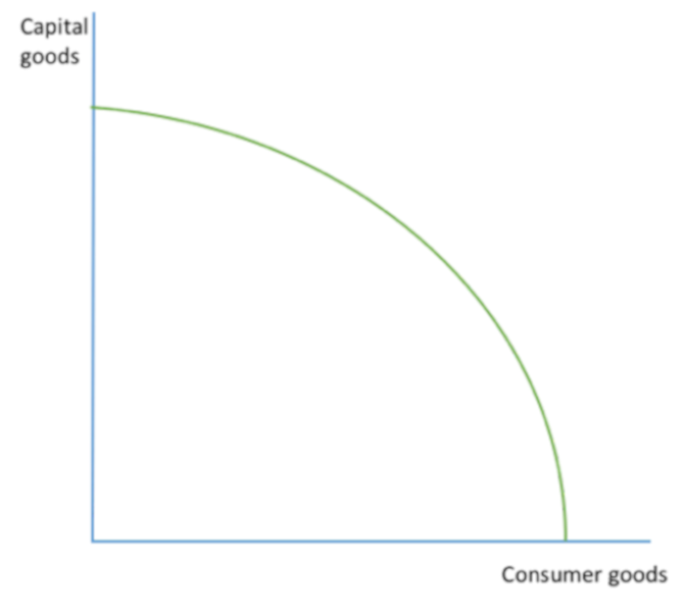

\tableofcontents

\newpage

# The Economic Problem

**The basic economic problem is** that there are infinite wants, but finite resources.

## The 4 Factors Of Production:
1. **Capital**: Man made aids to production
2. **Enterprise**: Entrepeuners, they aim to maximise profits.
3. **Land**: Natural resources such as oil or a plot of land.
4. **Labour**: Human resources such as workers.

## Opportunity Cost

**Opportunity cost** is the next best alternative foregone.

### Importance of Opportunity Cost's:

- **Consumers** want to maximise utility
- **Firms** want to maximise profits
- **Government** aims to maximise citizen welfare

# Economics As A Social Study

## The Assumption Of Ceteris Paribus:

Economists make the assumption that events happen with ceteris paribus.

**Ceteris paribus:** The assumption that all other factors remain constant.

**Positive statements:** A factual statement. 

- With these statements, you can either be true or false.
- You can remember this by thinking that whoever makes a *factual* statement, must be *positive* that he is right.

**Normative statements:** A value judgement.

# Production Possibility Frontiers

**The production possibility frontier shows:** 

1. The maximum possible output of an economy, given the current resources and technology.
2. The various combinations of 2 goods/ services that can be produced, given the factors of production and technology.

\

Any shifts outwards of the PPF displays economic growth.

The economy can not produce beyond the curve, except for in the very short run.

**Capital goods** are goods that are produced to be used in the production of other goods.

**Consumer goods** are goods and services that are produced to satisfy consumer demands and wants.

# Specialisation

**What is specialisation?** Specialisation is when production is concentrated in a small number of goods.

## Adam Smith's Contribution To Specialisation

**Adam Smith** was the one who stated the concept of specialisation, and the division of labour.

He said that labour productivity increases immensely, and therefore lowers the cost of production for firms.

## The Division Of Labour

**The division of labour is** when workers specialise in a particular part of the production process.

### Advantages of the division of labour

1. Labour productivity increases immensely
2. Workers become more skilled in what they specialise in
3. Specialisation leads to higher quality of goods being produced
4. Workers can use specialist tools to further improve speed and quality of production
5. Workers don't have to switch around and do any rotations which saves time
6. Workers only need to be trained to do a single thing

### Disadvantages of the division of labour

1. Work can become very boring if you are just doing one thing
   1. This can lead to poor quality goods being produced
   2. People may lave because of dissatisfaction
2. If one thing in the production process goes wrong, then all production has to stop.
3. Workers do not gain as many skills if they have to specialise

## Specialisation In The Production Of Goods And Services

This is when **countries or firms** specialise in producing a few number of goods.

### Advantages of specialisation in production

1. The theory of comparative advantage is put into practice
2. Increased trade and growth for an economy
3. Larger varieties of goods and services will be available
   - This is because when countries specialise, they usually also have free markets.
   - Free markets allow consumers to imports goods that they want from abroad
   - Another point to make is that if a country decides to specialise in one product, firms are likely to produce many different varieties of that product with small differences.
     - If your country is very competitive in the production of this good, then your country can almost monopolise the market for that good.
     - An example of this may be Germany and it's production of cars.

### Disadvantages of specialisation in production

1. Countries may overspecialise
   - If the country becomes out competed then it will mean their industries will decline
   -  This then leads to mass structural unemployment
   -  An example of this is the mass de-industrialisation of Europe, all of their industrial jobs went China and Asia.
2. High levels of interdependence for trade
   - Since you are only producing a few number of goods, you require other countries to trade with you for the goods you don't produce.
   - If a country places protectionist measures against you then it will lead to catastrophe as you can no longer make export revenue from the goods you specialise in making
3. Natural resources may run out
   - If your country specialises in the production of crude oil, then once it runs out, your main source of export revenue will be cut off

# The Functions of Money

There are 4 functions of money:

1. **A medium of exchange**: Can be used to buy and sell goods
2. **A measure of value**: Can be used to compare the values of different goods
3. **A store of value**: It is able to retain its value and you can keep store your wealth in money
4. **A method of deferred payment**: Money allows for debts to be created.

# Free Markets And Command Economies

## The Free Market:

Adam Smith was a famous free market economist, he spoke of market forces as the "invisible hand".

**What is a free market economy?** A free market economy, also known as a market economy, is an economy with minimal government intervention. The market is left to its own devices, and so the market dictates the allocation of scarce resources in the economy.

### Advantages of a free market economy:

1. The profit motive incentivises productive efficiency
2. There is a higher level of freedom, and more choice in the goods you want to purchase
3. Less bureaucracy from government intervention
4. There is allocative efficiency

### Problems with a free market economy:

1. There may be over-production of demerit goods, or goods with negative externalities.
2. Public goods will not be provided without *any* government intervention.
3. The distribution of income may be unequal
4. Monopolies/ oligopolies may form

## The Command Economy:

**What is a command economy?** A command economy is where the government centrally plans the allocation of all resources in the economy. The government is meant to allocate resources for the social good.

Karl Marx was a famous command economist, he wrote the Communist Manifesto which lead the ideological charge in _killing_ 100's of millions.

### Advantages of a command economy:

1. It is easier to co-ordinate resource allocation during crisis, such as war time.
2. The government can prevent market failure
   - However there may be government failure thanks to the intervention.
3. Inequality in society can be reduced

### Disadvantages of a command economy:

1. There may be massive government failure
2. Governments tend to be less efficient with the allocation of resources compared to the free market
3. The government may not produce things consumers want.
4. Command economies reduce the levels of freedom in an economy.

## Mixed Economies:

**What is a mixed economy?** A mixed economy is an economy with features from both command, and free market economies.

- Most countries in the world have mixed economies
- The advantage of mixed economies is that the government can intervene when they need to, such as supplying public goods
  - But they do not have the responsibility of allocating every single individual resource to everyone, which limits the scope of government failure

# Demand

**What is demand?** The quantity of goods and services consumers are willing to, and *able to* buy at any given price, within a given time period.

## The Law Of Demand

We know there is an inverse correlation between price and quantity demanded. The higher the price, the lower quantity is demanded.

### Why does the law of demand occur?

1. **The income effect:** As price increases, we cannot purchase as many goods with our income, lowering the quantity demanded.
2. **Substitution effect:** As the price of good x increases, we can switch our demand to good *y* instead. 
3. **Diminishing marginal utility:** The more quantity of a good we buy and consume, the utility gained also starts diminishing. This means we are less willing to pay higher prices for them.

## What Can Shift The Demand Curve?

**Remember PASIFIC**

Shifts in the demand curve are caused by changes in the conditions of demand.

1. **Population**: Higher population results in higher levels of demand for goods
2. **Advertising**: Good advertising increases our willingness to buy a product
3. **Substitute** pricing: An increase in the price of a substitute good results in an increase for our demand of this good
4. **Income**: Higher incomes mean you can afford more goods.
   - This is dependent on whether the good is an *inferior, normal or luxury good.*
5. **Fashion** and tastes: If a good becomes more fashionable, then it will experience higher demand for it.
6. **Interest** rates: If people have to borrow money to purchase the good, such as a car, then lower interest rates mean it will become cheaper to purchase the good.
   - This means there will be more demand for the good
7. Prices of **complementary** goods: If the price of a complementary good (good x) decreases, then the demand for it's complement good (good k) will increase.
   - An example is printers and printer ink.

# Supply

**What is supply?** Supply is the quantity of a good or service that a producer is willing to, and able to produce at any given price point, within a given time period.

## Law Of Supply

**What is the law of supply?** There is a direct relationship between price and quantity supplied. As price increases, quantity supplied will too.

### Why does the law of supply occur? 

Firms want profits so if prices increase, they will want to supply more goods.

## What Can Shift The Supply Curve?

**Shifts are caused by changes to the cost of production. Remember _PINT SWC_**

1. **Productivity**: Productivity is the output created by 1 unit of input.
   - Increased productivity means increased productive efficiency, leading to increased quantity supplied.
2. **Indirect tax**: Indirect taxes are paid partly by firms, increased indirect taxation means increased costs of production. This reduces supply.
3. **Number of firms in the market**: More firms joining the market leads to more supply created.
4. **Technology**: Technological improvements lead to innovation, which leads to lower production costs, leading to more supply.
5. **Subsidies**: Subsidies are grants given to firms by government to encourage production. These grants lower their production costs, increasing their quantity supplied.
6. **Weather**: If the good is produced only in a certain type of weather, then if that weather is not there, production will be decreased.
7. **Cost of commodities and other things linked to production**
   - Increases in prices of commodities leads to higher production costs, such as oil
   - Increased minimum wage leads to higher costs
   - Increased transport costs (can be caused by carbon tax)
   - Increased regulation increases production costs
 

# The Market Equilibrium

**What is a market?** A market is any place where buyers meet suppliers to exchange goods and services.

**Equilibrium** is where *demand = supply*

## Excess Supply In A Market

**Excess supply is caused by the price being above equilibrium.**

\

When price is at p2, you can see that excess supply is created (the orange).

## Excess Demand In A Market

**Excess demand is caused by a price below the equilibrium.**

## How Does The Market Deal With Excess Supply/ Demand?

**In a free market, disequilibrium never lasts because of market forces.**

**Remember ARSI**: Allocation, Rationed, Signals and Incentives.

### Dealing with excess supply

1. A **signal** is sent that the price is too high. This is because firms notice that they have unsold product in their stocks.
2. There is now an **incentive** for them to lower prices, and sell the rest of their stocks.
3. Once the price has been lowered to equilibrium, the excess supply has been **rationed**
4. The **allocation** of scarce resources is now perfect.

### Dealing with excess demand

1. A **signal** is sent that the price is too low. This is because the product gets sold out way too quickly.
2. There is now an **incentive** for them to increase prices, and sell the good at a higher price to maximise profits.
3. Once the price has been increased to equilibrium, the excess demand has been **rationed**
4. The **allocation** of scarce resources is now perfect.

# The Price Mechanism

**What is the price mechanism?** The price mechanism is what allocates resources in a free market.

## The 3 Functions Of Price In Allocating Scarce Resources 

1. **Rationing function**: If a good is rare (low supply), and it has high levels of demand, the price will rise for that good, to ration it.
2. **Signalling function**: The price of goods give signals to buyers and sellers on whether they should buy/sell the good.
   + For example, firms may see that the price of a good is increasing so they want to switch their production to produce it
3. **Incentive function**: Prices act as an incentive to buyers and sellers to behave in a certain way
   + An example is if the price is high for a good, then it will discourages buyers from purchasing as much, and encourages producers to produce more of it.
   + These incentives ensure that the allocation of resources is at optimum levels.

# Consumer And Producer Surplus

## Consumer Surplus

**Consumer surplus is** the difference between the prices consumers are *willing* to pay for a good, and what they *actually* pay for it.

/ Diagram?

## Producer Surplus

**Producer surplus is** the difference between the prices the producer is *willing* to sell for, and the price they *actually* sell the good for.

/ Diagram

**Societal Surplus** is *producer surplus* **+** *consumer surplus*.

\newpage

# Elasticities

## Price Elasticity Of Demand (PED)

**What Is Price Elasticity Of Demand?** PED measures the responsiveness of how quantity demanded changes, when price changes.

**Formula for PED:** 

\begin{center} \begin{huge}$\frac{\% \vec{\Delta}In Quantity Demanded}{\% \vec{\Delta} In Price}$ \end{huge} \\ \end{center} \\

- PED higher than 1 means price elastic (increase in price leads to bigger decrease in quantity demanded).
- PED of 1 means unit price elastic (price and quantity demanded change proportionally).
- 0 means perfectly price inelasticity (changes to price will never affect the amount of quantity demanded).
- Infinity means perfectly price elastic (any change to price will lead to demand becoming 0).
- PED lower than 1 means demand is price inelastic (demand is not very responsive to changes in prices).

### What determines the price elasticity of demand?

**Remember SPLAT**

1. **The number of substitutes**: More substitutes leads to higher PED
2. **The cost of the good as a % of your income**: Higher percentage means higher price elasticity of demand
3. **Is the good a luxury or a necessity?**: Luxury goods will have a higher price elasticity of demand.
4. **Is the good addictive or habit forming?**: Demand will likely be price inelastic if the good is addictive.
5. **What is the time period?**: In the long run, demand tends to be more price elastic as consumers will have the time to adapt to any price changes, while in the short run, demand will likely be price inelastic.

**Firms also use PED to maximise revenues:**

- When their good has price inelastic demand, they *raise* prices, which then raises their revenue
  - This is because price increases cause a less than proportional change to the quantity demanded
- If their good has price elastic demand, they *decrease* prices, which causes their revenues to increase
  - This is because price decreases cause a more than proportional change to the quantity demanded

### Price elasticity of demand varies along the demand curve:

- The **first half** of the demand curve is when demand is ***price elastic***.
- The **middle** of any demand curve is when it is ***unit elastic***.
  - Firms can *maximise their revenue* if they sell at this point.
- The **bottom half** of the demand curve is when demand is  ***price inelastic***.

## Income Elasticity Of Demand (YED)

**What is income elasticity of demand?** YED measures the responsiveness of the change in quantity demanded when there is a change in to the income of a person.

**Formula for YED:**

\begin{center} \begin{huge}$\frac{\% \vec{\Delta}In Quantity Demanded}{\% \vec{\Delta}In Income}$ \end{huge} \\ \end{center} \\

- An **inferior good** has a *negative* YED.
- A **normal good** has a *positive* YED, bigger than 0.
  - A rise in income also leads to a rise in demand.
- A **luxury good** is a type of normal good, but when YED is *larger than* 1.
  - Luxury goods have demands that are **income elastic**.

### Why firms care about YED:

Firms care about the YED of their good's as they can potentially *raise* prices when there is a boom (people have higher incomes). 

## Cross Elasticity Of Demand (XED)

**What is cross elasticity of demand?** XED measures the change in the quantity demanded of *good x* when there is a change in price of *good k*.

**Formula for YED:**

\begin{center} \begin{huge}$\frac{\% \vec{\Delta}InDemandOf Good X}{\% \vec{\Delta}InPriceOfGood K}$ \end{huge} \\ \end{center} 

- A **positive** XED means the two goods are *substitutes*
- A **negative** XED means they are *complementary* goods
- A XED of **0** means there is no relationship at all and they are perfectly cross *inelastic*.

### Why firms care about the XED of their products:

1. If firms know that goods are *complementary*, then they can decrease the price of good x and increase the price of good k, which leads to potentially increased revenue.
2. Also, if firms know that there is a rival good which is a substitute of their own, they can try competing on *non price factors*
   1. This means they don't have to engage in a price war, and even if the competitor good has a decrease in it's price, you will still have strong demand for your product as it is better in terms of *non price factors*.

## Price Elasticity Of Supply (PES)

**What is price elasticity of supply?** PES measures the responsiveness of quantity supplied when there is a change in price.

- This essentially means, PES is a measure of how much firms will change the amount they will supply of good x, given there is a change to the price of good x. 

**Formula for PES:**

\begin{center} \begin{huge}$\frac{\% \vec{\Delta}InTheQuantitySupplied}{\% \vec{\Delta}InPrice}$ \end{huge} \\ \end{center} 

### What determines the price elasticity of supply?

**Remember PSST**

1. **Production** lags: The longer it takes to produce a good, the more price *inelastic* supply will be.
2. **Stocks**: The more stock a firm has of a good, the easier it is for them to supply more, making supply more price *elastic*.
3. **Spare** capacity: If a firm has a lot of spare capacity, they can easily use that spare capacity to supply more of the good. This means supply will be price *elastic*.
4. **Substitutability** of the factors of production: If factors of production are easily substituted, this allows the firm to easily switch between producing good *x* to producing good *k*. This means supply is price *elastic*.
5. **Time** period: Supply tends to be more *in-elastic* in the short run as there is at least 1 factor of production fixed in quantity. But in the long run, all factors of production are variable, so supply will be more price *elastic*.

### Why firms care about their PES:

Firms want to find ways to make their supply **price elastic**
- This is because they can sell a higher quantity when demand *increases*
- They can save themselves the cost of production when demand for their good *decreases*

## Evaluating The Usage And Relevance Of Elasticities:

1. Elasticities are only *estimates*
2. Elasticities assume ceteris paribus 
   - This means in the real world there may other factors that may influence the elasticities of goods.
3. Price elasticity of demand *varies* along the demand curve
   - This means a change in price may not have the same effects that it did previously
   - An example is if the price is dropped from 20 dollars to 15 dollars (which is a decrease of 25%), and you receive an increase in demand of 25%
     - But then you decrease the price by a further 25% (which decreases the 15 dollars to 12.75)
     - The change in price as a percentage may be the same but people will not see it like that, to consumers it looks like the price has only changed very minimally.

# Market Failure: An Introduction

**What is market failure?** Market failure is when the free market fails to allocate resources at the socially optimum levels.

## What Is The Social Optimum?

The social optimum level of production is either:

1. **Demand = Supply**: This is when resources are perfectly allocated *according to consumer demand*.
2. **Marginal Social Benefit = Marginal Social Cost**: This is when net social welfare is maximised.

## What Types Of Market Failure Are There?

- **Partial market failure**: The market either overproduces a demerit good, or under-produces a merit good.
- **Complete market failure**: This is also known as a *missing market*, this is when the market fails to supply any of a good (which has demand).

## What Are The Causes Of Market Failure?

1. **Self interest**: Economic agents are assumed to maximise their own benefits
   - This leads to over-production of demerit goods by firms
   - This leads to over-consumption of demerit goods by consumers
2. **Under-provision of public goods**: Firms are motivated by profit so in  aa free market public goods may be under-produced 

3. **Information gaps**: Consumers may experience information failure, which means they will have imperfect knowledge.
   - Imperfect knowledge then leads to irrational decisions such as over-consumption of demerit goods.

# Market Failure: The Under-Provision Of Public Goods

## What Is A Public Good?

A **public good** is a good that is non-rival, and also non excludable.

- **Non rival** means consumption of the good does not reduce the availability of the good for anyone else.
  - An example is the *light* given by a street lamp.
- **Non excludable** means that once the good has been provided, no one can be excluded from the benefits of the good, and equally, no one can *reject* the consumption of that good (non rejectability).
  - An example of this is national defence.
- Another characteristic of a pure public good is that the *marginal cost of providing another good* is **0**.

**Quasi public goods** are goods that have characteristics of both public, and private goods.
- An example is toll roads. People can drive on it if they want to, but they are expected to pay.

## The Free Rider Problem

1. The free rider problem is when someone receives the benefits of a good that is provided, but without paying for it.
2. Since public goods are non excludable, everyone can benefit from the good and be a "free rider".
3. This means there is little incentive to pay the firm for the good, since you are enjoying it without nay cost.
4. Therefore since everyone wants to maximise their own welfare, consumers of the good will not want to pay for the good, without them paying, firms have no incentive to provide the good as they earn no profits.

# Market Failure: Externalities

**What is an externality?** An externality is a cost or benefit a 3rd party recieves from an economic transaction that they were not a part of.

## Negative Externalities

**Negative externalities are** cost's incurred to a 3rd party.

### [ ]Negative externalities caused by over-consumption:

1. Since a consumer is out to maximise their own personal utility, the consumer does not care about the marginal social benefit of his actions, he only cares about his own *marginal private benefit*.
2. This means that the consumer will over-consume goods that have negative externalities, these negative externalities reduce societal welfare
3. This leads to a social welfare loss, due to over-consumption (at the free market equilibrium).

/ Include Diagram

### [ ] Negative externalities caused by over-production

# Market Failure: Information Gaps

**What is an information gap?** Information gaps are when an economic agent doesn't have perfect knowledge. This may be in the form of asymmetric information or imperfect information.

Most economic decisions tend to be made without perfect information.

**What is imperfect information?** Imperfect information is when an economic agent does not have all the necessary information to be able to make an informed economic decision.

## Asymmetric Information

**Asymmetric information is** when one party (the firm or the buyer) has more information than the other.

- Firms tend to have superior knowledge about the good as they are the ones that produce it
- This then means firms can take advantage of consumers since consumers will have *information gaps*, allowing them to be exploited without realising.
- Asymmetric information leads to market failure as there will be inefficient allocation of resources in the market.
 

## Symmetric Information

**Symmetric information is** buyers and sellers have access to the same information.

- Firms and consumers both have the same level of knowledge about a good or service.
- Symmetric information leads to *an efficient* allocation of resources in a market.

## Merit Goods

**Merit goods are** goods that are deemed to be more beneficial than consumers actually realise, they also produce positive externalities.

- Merit goods generate *positive externalities* on consumption.
- Since consumers do not realise the benefits and utility gained from consuming the good which is caused by information failure, merit goods tend to be *under-consumed* in a free market.
  - An example of a merit good is education. Since the utility gained from the consumption of education is very delayed, consumers do not realise the overall benefit of the good.
- Merit goods also tend to be subsidised by the government, to promote production and consumption.
- Merit goods are also under-produced in the free market.
  - This is because in a free market the quantity produced will be at the market equilibrium, which is lower than the social optimum level of production.

## Demerit Goods

**Demerit goods are** goods that are deemed to be more harmful to consumers than what they realise, they also produce negative externalities.

- Demerit goods are over-consumed and over-produced in a free market.
  - Since demerit goods produce negative externalities, this means social welfare is lower than what it could be if the demerit good was not produced / consumed as much.

### Why are demerit goods over-produced and over-consumed?

1. The first reason is that consumers often suffer from information failure.
   - This is in the form of either asymmetric information or imperfect information.
   - Due to this information failure, consumers do not understand the negative effects of their consumption of the good.
2. The second reason is created by the first. In demerit goods, firms often know that the goods they are producing are very harmful to the consumers and wider society, yet they still produce it.
   - This is an example of how asymmetric information can be used to exploit consumers and lead to societal welfare loss.
   - This all means the level of output for that good is higher than the social optimum.

## Evaluating Merit And Demerit Goods

1. Please note that the classification of merit and demerit goods are normative
   - This means they are a matter of opinion and therefore some may argue the government shouldn't intervene in these markets.
2. Since the over-consumption of demerit goods and under-consumption of merit goods are caused by information failure, it might be better to help educate consumers instead of trying to intervene in the market (such as higher taxes to reduce production, etc).

# Government Intervention: Indirect Taxes

**What are indirect taxes?** Indirect taxes are taxes put on expenditure rather than income.

There are two types of indirect taxes, ad valorem and specific.

## Ad Valorem Taxes 

**What are ad valorem taxes?** These taxes are a percentage of the price of a good or service.

- An example of this type of tax is VAT. It is a percentage of the final sale price of the good.
 - / Include Image Of Tax

## Specific Taxes 

**What are specific taxes?** These are a set tax per unit of good.

-  Such as the 58p per litre fuel duty on unleaded petrol.
- / Include Image Of Tax

## 

## The Effect Of Indirect Taxes:

### A diagrammatic analysis:

/ Include Image Of Tax

**So what is happening?**

1. **Supply shifts upwards as** firms incur higher production costs due to the tax.
2. **The price *increases* from P1 to P2, and quantity *decreases* from Q1 to Q2**.
3. **Producer pays P1, D, C, E** amount of the tax
   - This leads to a **loss in revenue** for them of **O, Q2, C, E**  
4. **The consumer pays P1, P2, B, D** amount of the tax  
5. There is a **dead weight loss of A, B, C**
6. Government revenue **increases by E, P2, B, C**

### On different groups:
- **Consumers**:
  1. Less consumer surplus as consumers now have to pay a higher price thanks to the tax
  2. Consumers end up paying a large amount of indirect taxes when the demand for a good is price inelastic.
  3. Workers can suffer thanks to increased taxes, this is because production costs for firms will rise, and firms may have to make redundancies to save costs 
- **Producers**:
  1. Producers do not like indirect taxes as it reduces their own producer surplus
  2. Firms may have to fire people to save costs
  3. If demand for the good being taxed is price elastic, that means the firm will have to absorb more of the tax burden to ensure demand doesn't fall dramatically.
- **Government**:
  1. The government will earn more revenue
  2. If the demand for the good being taxed is price inelastic, that means the firm will not have to burden a lot of the tax, meaning they won't have to make redundancies

# Government Intervention: Subsidies
  
**What is a subsidy?** A subsidy is a money grant given to producers to promote production.

## The Effects Of A Subsidy:

### Diagrammatic analysis:

### The effect on individual groups:

1. **Consumers**
   - Higher consumer surplus as the price will decrease
   - But this is not always the case if the producer decides to **not** pass all of the potential savings to the consumer
2. **Producers**
   - They increase their producer surplus
   - They enjoy lower production costs
   - They get higher revenues  
4. **Government**
   - The government has to pay for the subsidy which they could have put elsewhere
     - This has an opportunity cost
   - They also have to consider where the subsidy money is coming from
     1. If money has to be borrowed to be able to give the subsidy, then this may lead to tax increases
     2. Tax increases in the short run will not be popular and so there may be backlash from consumers
     3. But if the government *does not increase* taxes, then it will result in future generations having to bare the burden of what they did not directly benefit from

# Government Intervention: Minimum Pricing

**What is minimum pricing?** Minimum pricing is when a good is price fixed so that it cannot be sold *below* a certain price, this price is known as the *price floor*.

**Why use minimum pricing?**

- Minimum pricing is often used in an attempt to safe guard the jobs of an industry.
  1. This is because the industry equilibrium price may be deemed too low, this leads to lower revenues for firms
  2. If firms have lower revenues, then that leads to them trying to save costs by firing workers or paying them lower wages
- But some may argue that minimum pricing is harmful because of the lost consumer surplus, and the creation of a *dead weight loss*.

## The Effects Of Minimum Pricing:

### Diagrammatic analysis:

### The effect on individual groups:

**Government**

1. The government is forced to buy all of the excess supply
   - This is known as intervention buying
   - The government now has all of this supply of a good and they need to deal with it somehow (burning, dumping, etc).
   - This all has a very high opportunity cost.
2. They have to consider the political popularity of the minimum pricing
   - As governments are held to account by citizens, they may receive a backlash from consumers who suffer from the minimum pricing.
   - Firms however will appreciate the minimum pricing.

**Producers**

1. Producers will enjoy greater producer surplus, and greater revenues. 

**Consumers**

1. Consumers do not like a minimum price as they have to pay more
   - This then leads to reduced consumer surplus and reduced demand for the good
   - If the good was a merit good then it will lead to decreased societal welfare as consumption will decrease
   - This is a negative for society. 

# Government Intervention: Maximum Pricing

**What is maximum pricing?** Maximum pricing is when a good is price fixed below the equilibrium price, this price is known as the price ceiling.

Maximum pricing is often used to try controlling inflation, or try protecting consumers.

## The Effects Of A Maximum Price:

### Diagrammatic analysis:

### Effects on individual groups:

**Government**

1. The government has to monitor whether black markets form
   - This can then lead to government failure if there are black markets that form and the government does not know about them or cannot deal with them.  
2. The government normally also *subsidises* production of the good
   - This is because firms can try filling the excess demand created by the maximum price.
   - This has an opportunity cost.

**Producers**

1. Producers do not like maximum prices as they will earn less revenue and have lower producer surplus
   - This means they will produce less goods
   - Less output means they have to fire workers

**Consumers**

1. Consumers benefit from the lower prices and enjoy a larger consumer surplus
2. But due to the excess demand created by the maximum price, consumers may not even be able to *purchase* the good for consumption
   - This defeats the purpose of a maximum price as *less* consumers will consume the good.

\newpage

# Government Intervention: Other Forms Of Intervention

## Tradeable Pollution Permits

**What are tradeable pollution permits?** Pollution permits are given to firms to limit their pollution to only the specific amount allowed in the permit. These permits can be traded.

- The government controls the number of permits there are, and so they can control the amount of pollution in that year
- The goal is to lower pollution overall, so they will intentionally reduce the number of permits as the years go by, thus reducing pollution also
- These permits can also be traded from one firm to another

**Benefits of tradeable pollution permits:**

1. It gives incentives to companies to invest into greener production methods
2. Generates government revenue as the government sells these permits to firms
3. Reduces pollution as firms will be limited to the amount on their permit
   
**Disadvantages of tradeable pollution permits:**

1. It is expensive to monitor and enforce for the government
2. Raises costs for firms, thus potentially raising prices for consumers
3. Government needs to know how many permits to produce and give out to ensure that pollution is going down
   1. Government may have information failure and produce too many permits, thus increasing pollution
4. Smaller firms may be pushed out of the industry as they cannot afford to pay for permits
   1. This then means the industry will become less competitive, potentially turning into an oligopoly or monopoly.

## The Provision Of Information

**What is the provision of information?** The provision of information is a government intervention strategy that aims to provide information to consumers, in an attempt to reduce information failure and increase rational decision making.

**Advantages of provision of information:**

1. Helps fill information gaps in consumers
2. Consumers will act more rationally

**Disadvantages of provision of information:**

1. This can be very expensive
2. Consumers may not listen, especially if what they are doing is habitual or addictive
3. The government themselves may not be very well informed on the matter themselves, therefore leading to government failure

## Regulation

**What is regulation?** The government introducing new laws and rules for the market and industry to follow.

**Advantages of regulation:**

1. Can help protect consumers/workers
2. Environmental regulation can lead to less pollution
3. Regulation can help maximise social welfare in the market

**Disadvantages of regulation:**

1. Monitoring firms to ensure they follow regulations may be too expensive for the government
   1. If firms know this then they will not follow the regulations
2. Pollution permits tend to be better at reducing pollution than regulation on pollution.
3. Higher costs for consumers as production costs will rise for firms
4. Small firms may not be able to afford following the regulations
   1. This then leads to them leaving the market
   2. This then makes the market less competitive, and may eventually morph into an oligopoly or monopoly.
5. High levels of domestic regulation may mean lower competitiveness internationally
   1. This is because firms abroad may not be subject to the same level of regulation (if at all)
6. The government may experience regulatory capture
   1. This is when the regulators may have an implicit bias for the industry, making them act *in the industry's favour* rather than in society's favour.

# Government Failure

**What is government failure?** Government failure is when a government intervention results in a net welfare loss in society.

This means the intervention did more harm than good.

## What Are The Causes Of Government Failure?

1. **Distortions of price signals:** Government intervention such as subsidies can distort price signals, leading to an inefficient allocation of resources.
2. **Unintended consequences of the intervention:** This is when an intervention results in unintended consequences
   1. An example of this is when a maximum pricing creates a black market.
3. **Excess administration costs:** This is when the monetary cost of implementing policy may be much higher than the social benefits derived.
4. **Information gaps:** The government may intervene without perfect knowledge, meaning they may make irrational decisions.

# Alternative Views On Consumer Behaviour

The underlying assumption for all rational decisions is that consumers aim to maximise utility. However, this may not always be the case.

## Why Do Consumers Not Always Act Rationally?

**Influences of other people:** People may be influenced by others around them.

1. This means they may behave irrationally if they have been influenced to do so.
2. This is normally caused by underlying societal norms and biases that people do not want to go against

**Influence of habitual behaviour:** People often act on impulses (habits). This means that a habit may make them make irrational economic decisions.

1. An example of this is when people automatically assume that a multi-pack of 6 is cheaper than just buying 6 single items.

**Consumer weakness at computation:** Many consumers do not actually stop and calculate the price to value ratios of products, and other things that will increase their utility. This is mainly down to consumers not being very strong at computing things statistically.

